# Polymarket 통계 리포트

생성 시점 / 최근 반영 시점 기준

본 문서는 Polymarket의 공개 데이터를 기준으로 집계한 결과입니다.
생성 시점은 원본 createdAt, 반영 시점은 각 id의 최신 collected_at_utc를 기준으로 계산합니다.
내부 저장/구현 방식과 무관하게, 공개 데이터 흐름 관점에서 정리된 통계만 제공합니다.

## 시리즈

- 전체 고유 개수: **1,411**
- 생성 시점 범위: 2022-10-13T00:34:06Z ~ 2026-04-07T17:23:16Z
- 최근 반영 시점 범위: 2026-04-03T12:12:41Z ~ 2026-04-07T17:48:44Z

## 이벤트

- 전체 고유 개수: **343,686**
- 생성 시점 범위: 2022-07-27T14:40:02Z ~ 2026-04-07T17:26:59Z
- 최근 반영 시점 범위: 2026-02-17T19:39:34Z ~ 2026-04-07T17:37:39Z

## 마켓

- 전체 고유 개수: **831,586**
- 생성 시점 범위: 2020-10-02T16:10:01Z ~ 2026-04-07T17:37:06Z
- 최근 반영 시점 범위: 2026-02-28T10:01:20Z ~ 2026-04-07T17:43:59Z

### 시리즈 / 생성 시점 / 연도별

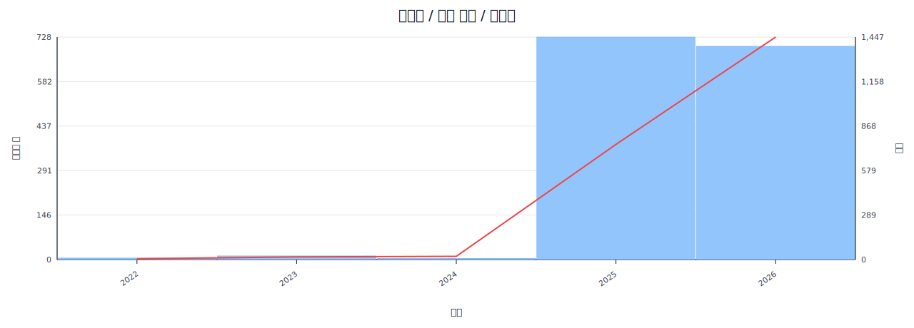

상위 구간:
  - 2025: 728
  - 2026: 662
  - 2023: 12
  - 2022: 5
  - 2024: 4

### 시리즈 / 최근 반영 시점 / 연도별

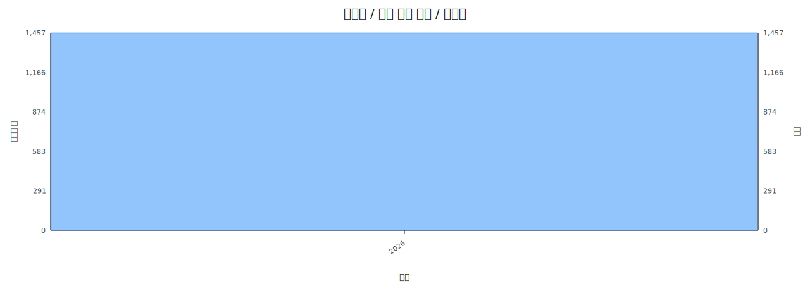

상위 구간:
  - 2026: 1,411

### 시리즈 / 생성 시점 / 월별

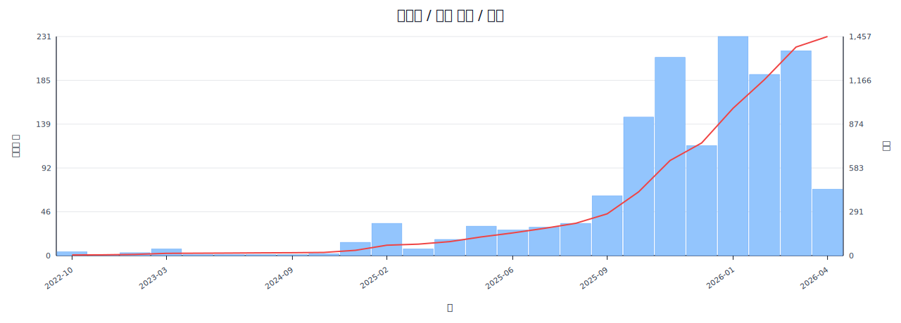

상위 구간:
  - 2026-01: 231
  - 2026-03: 216
  - 2025-11: 209
  - 2026-02: 191
  - 2025-10: 146

### 시리즈 / 최근 반영 시점 / 월별

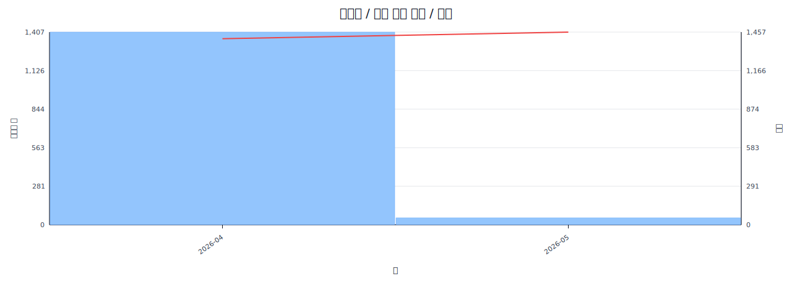

상위 구간:
  - 2026-04: 1,411

### 시리즈 / 생성 시점 / 일별

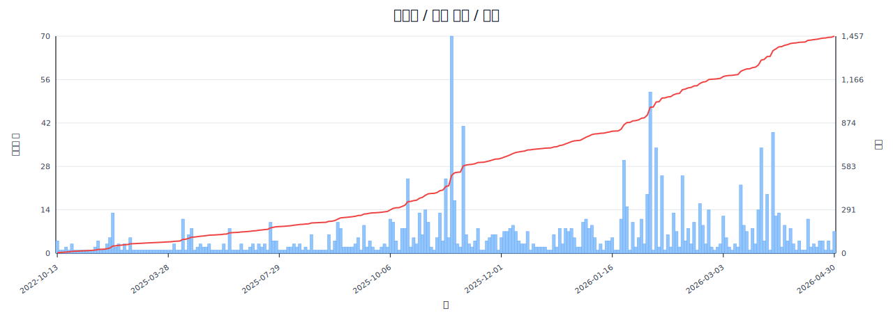

상위 구간:
  - 2025-11-05: 70
  - 2026-01-31: 52
  - 2025-11-11: 41
  - 2026-03-26: 39
  - 2026-02-03: 34

### 시리즈 / 최근 반영 시점 / 일별

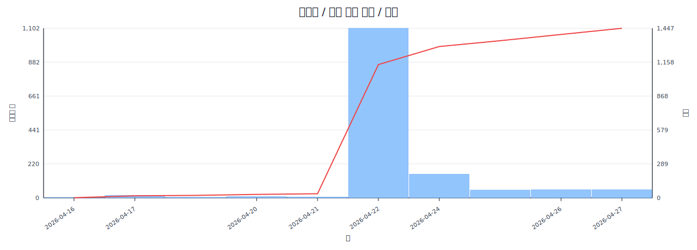

상위 구간:
  - 2026-04-07: 1,409
  - 2026-04-03: 1
  - 2026-04-04: 1

### 시리즈 / 생성 시점 / 시간별

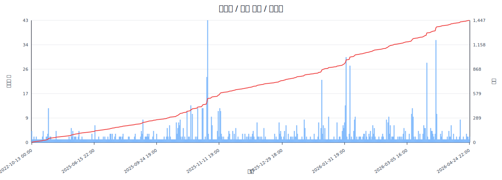

상위 구간:
  - 2025-11-05 20:00: 43
  - 2026-03-26 22:00: 36
  - 2026-01-31 21:00: 30
  - 2026-03-20 20:00: 28
  - 2026-02-03 16:00: 27

### 시리즈 / 최근 반영 시점 / 시간별

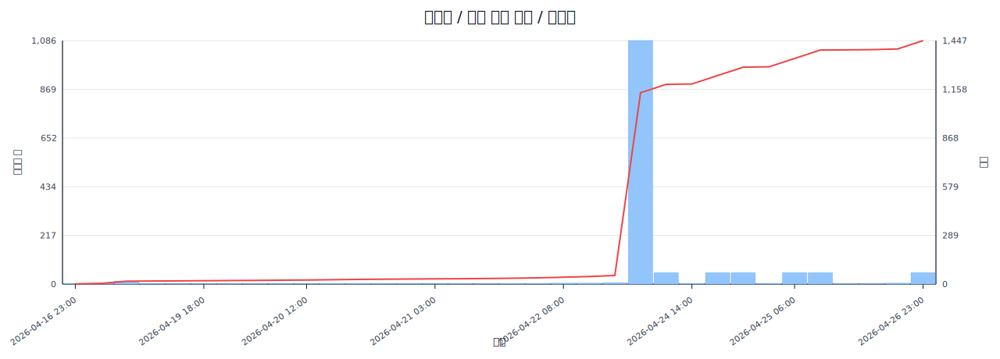

상위 구간:
  - 2026-04-07 17:00: 1,408
  - 2026-04-03 12:00: 1
  - 2026-04-04 21:00: 1
  - 2026-04-07 16:00: 1

### 이벤트 / 생성 시점 / 연도별

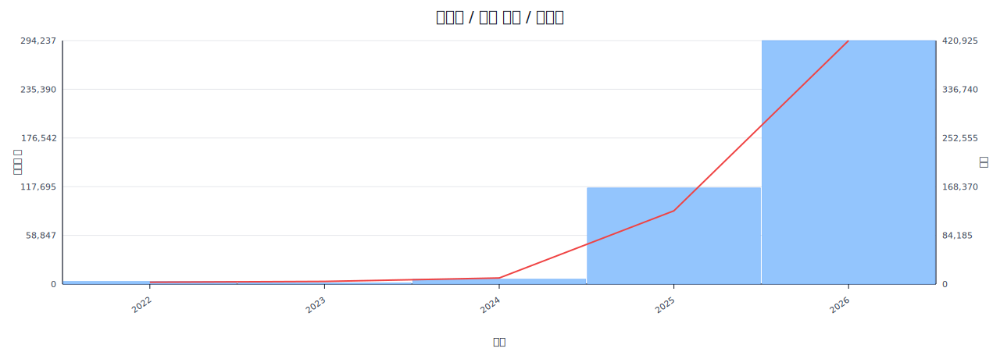

상위 구간:
  - 2026: 216,998
  - 2025: 116,169
  - 2024: 5,912
  - 2022: 3,171
  - 2023: 1,436

### 이벤트 / 최근 반영 시점 / 연도별

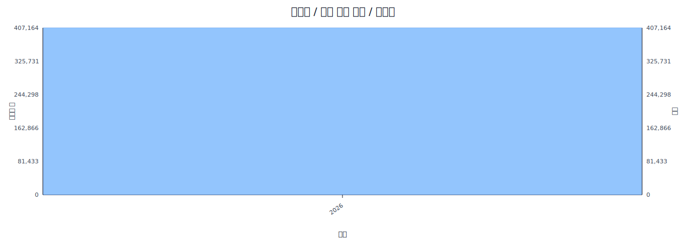

상위 구간:
  - 2026: 343,686

### 이벤트 / 생성 시점 / 월별

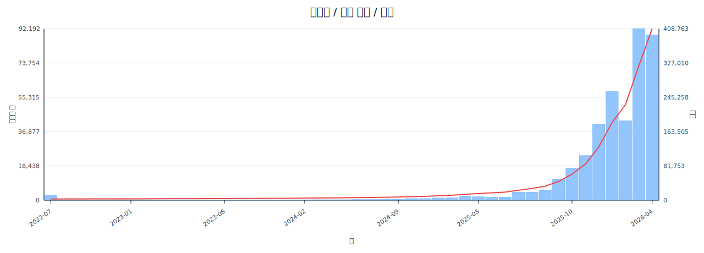

상위 구간:
  - 2026-03: 92,188
  - 2026-01: 58,354
  - 2026-02: 42,651
  - 2025-12: 40,802
  - 2025-11: 23,997

### 이벤트 / 최근 반영 시점 / 월별

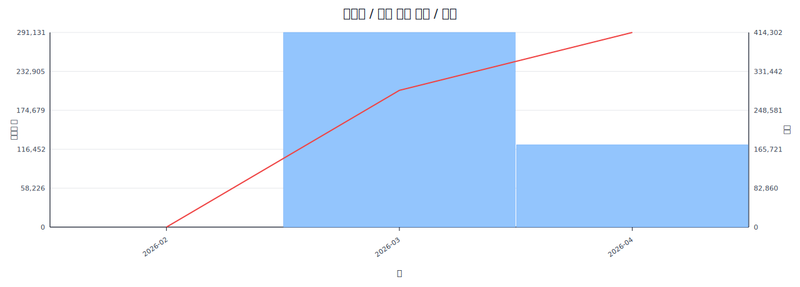

상위 구간:
  - 2026-03: 291,283
  - 2026-04: 52,402
  - 2026-02: 1

### 이벤트 / 생성 시점 / 일별

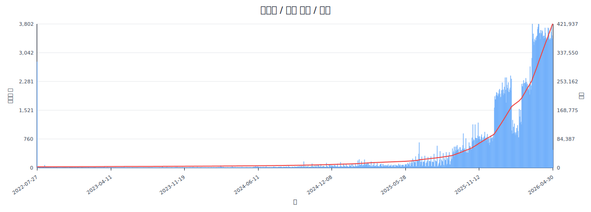

상위 구간:
  - 2026-03-14: 3,802
  - 2026-03-28: 3,801
  - 2026-03-29: 3,794
  - 2026-03-27: 3,718
  - 2026-03-26: 3,662

### 이벤트 / 최근 반영 시점 / 일별

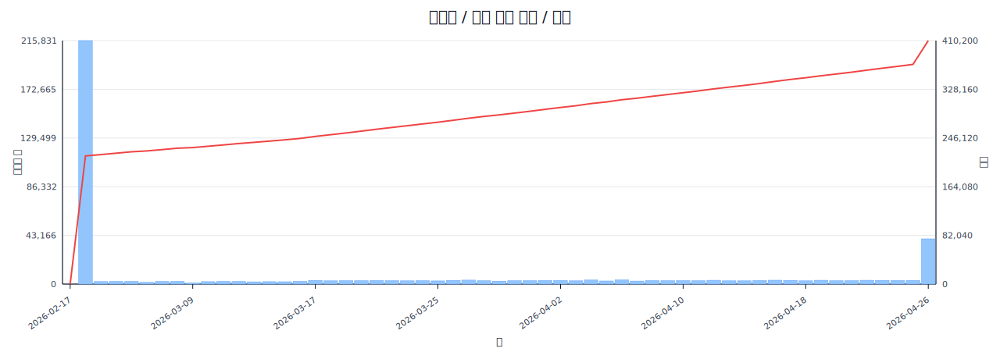

상위 구간:
  - 2026-03-02: 215,938
  - 2026-04-07: 32,892
  - 2026-04-06: 3,732
  - 2026-04-04: 3,635
  - 2026-03-27: 3,508

### 이벤트 / 생성 시점 / 시간별

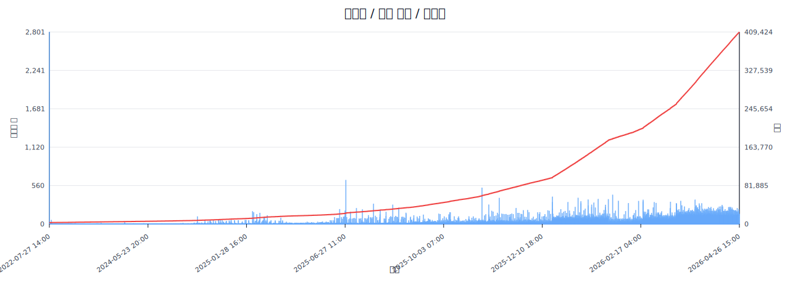

상위 구간:
  - 2022-07-27 14:00: 2,801
  - 2025-06-28 20:00: 639
  - 2025-10-29 22:00: 527
  - 2026-01-28 15:00: 424
  - 2025-12-17 21:00: 396

### 이벤트 / 최근 반영 시점 / 시간별

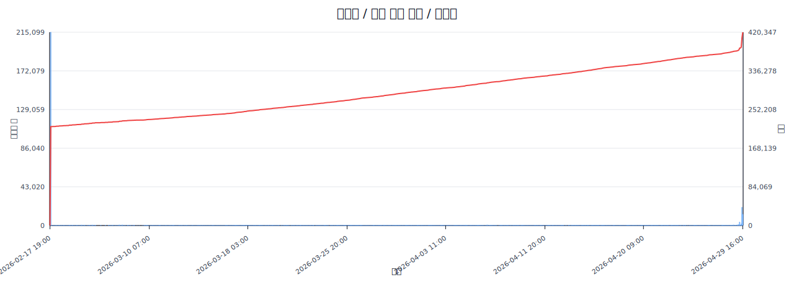

상위 구간:
  - 2026-03-02 15:00: 215,214
  - 2026-04-07 17:00: 28,942
  - 2026-04-07 15:00: 1,849
  - 2026-04-06 21:00: 713
  - 2026-03-07 23:00: 711

### 마켓 / 생성 시점 / 연도별

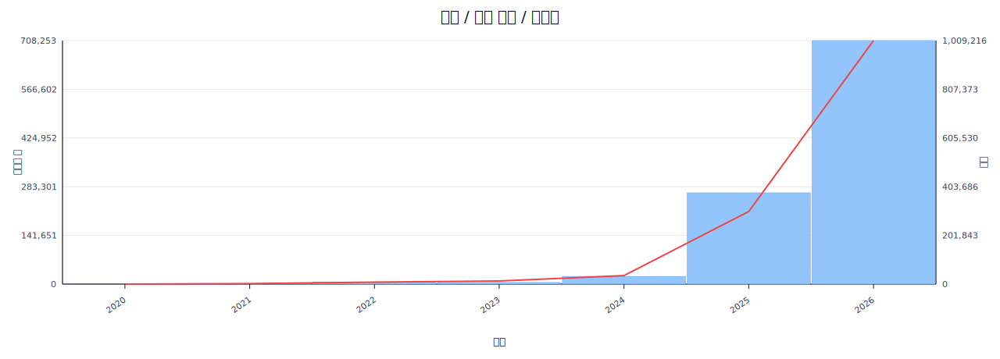

상위 구간:
  - 2026: 530,629
  - 2025: 265,594
  - 2024: 22,515
  - 2022: 6,068
  - 2023: 4,861

### 마켓 / 최근 반영 시점 / 연도별

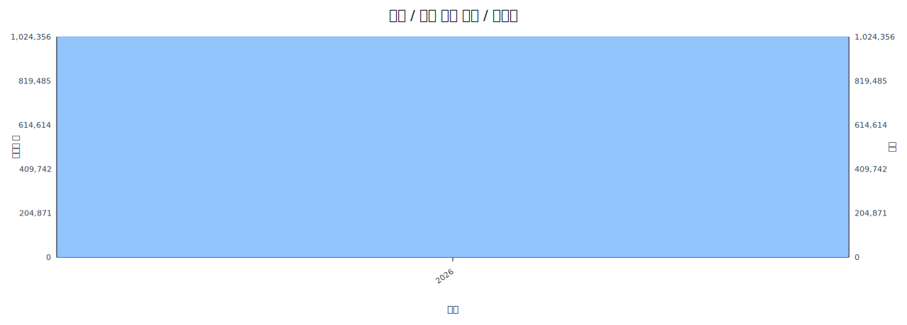

상위 구간:
  - 2026: 831,586

### 마켓 / 생성 시점 / 월별

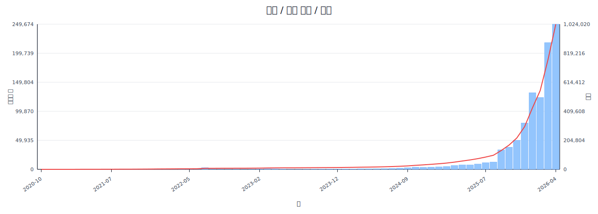

상위 구간:
  - 2026-03: 217,794
  - 2026-01: 131,872
  - 2026-02: 123,640
  - 2025-12: 79,776
  - 2026-04: 57,323

### 마켓 / 최근 반영 시점 / 월별

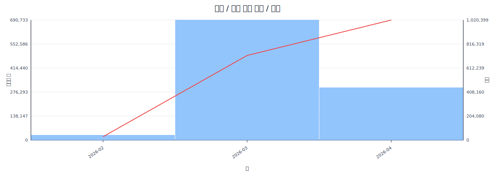

상위 구간:
  - 2026-03: 690,902
  - 2026-04: 112,302
  - 2026-02: 28,382

### 마켓 / 생성 시점 / 일별

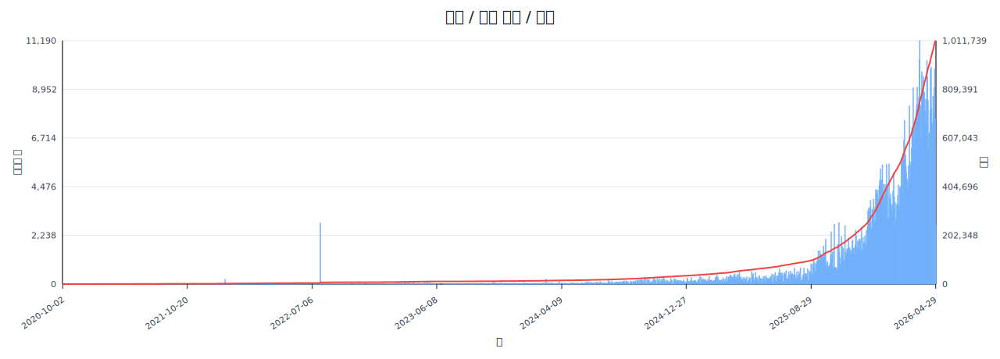

상위 구간:
  - 2026-03-29: 11,190
  - 2026-03-28: 10,303
  - 2026-04-02: 9,752
  - 2026-04-05: 9,541
  - 2026-03-24: 9,050

### 마켓 / 최근 반영 시점 / 일별

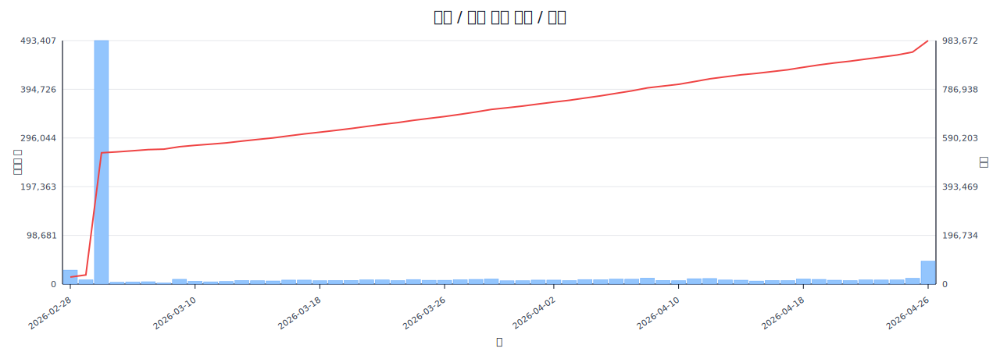

상위 구간:
  - 2026-03-02: 493,407
  - 2026-04-07: 60,484
  - 2026-02-28: 28,382
  - 2026-04-06: 10,427
  - 2026-03-29: 10,386

### 마켓 / 생성 시점 / 시간별

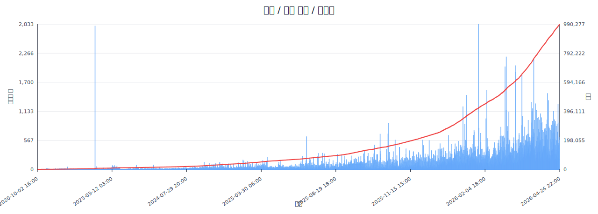

상위 구간:
  - 2026-01-28 15:00: 2,833
  - 2022-07-27 14:00: 2,799
  - 2026-02-27 19:00: 2,197
  - 2026-03-29 18:00: 2,154
  - 2026-03-09 16:00: 2,026

### 마켓 / 최근 반영 시점 / 시간별

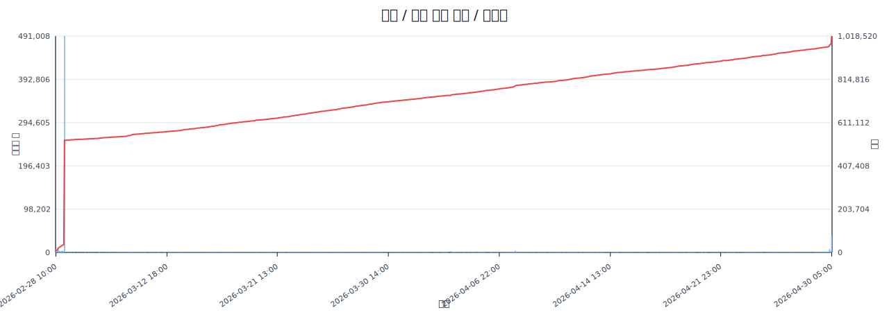

상위 구간:
  - 2026-03-02 15:00: 491,044
  - 2026-04-07 17:00: 31,941
  - 2026-04-07 16:00: 11,778
  - 2026-02-28 19:00: 7,398
  - 2026-02-28 10:00: 6,268

