# Polymarket 수집 통계

- 실행 시각: 2026-03-01 16:57:28 UTC
- 대상 DB: `statground_polymarket`

> **주의**: series/event/market 테이블은 ReplacingMergeTree 기반 최신 1행 유지 구조입니다.

> 따라서 **수집 시점 기준 통계는 ‘최신 스냅샷이 마지막으로 수집된 시점’ 분포**이며, ‘최초 발견(first_seen)’ 통계는 아닙니다.

## 요약

| 구분 | 행 수 | 고유 ID 수 | 생성시각 NULL 행 | 최소 생성 시각 | 최대 갱신(유효) 시각 | 최대 수집 시각 |
|---|---:|---:|---:|---|---|---|
| 시리즈 | 1,401 | 1,171 | 0 | 2022-10-13 00:34:06.557000 | 2026-03-01 16:38:10.664000 | 2026-03-01 16:40:27.438000 |
| 이벤트 | 215,991 | 215,334 | 0 | 2022-07-27 14:40:02.074000 | 2026-03-01 16:52:10.487000 | 2026-03-01 16:56:02.806000 |
| 마켓 | 575,713 | 545,952 | 0 | 2020-10-02 16:10:01.467000 | 2026-03-01 16:55:27.239000 | 2026-03-01 16:57:31.142000 |

## 시리즈

### 생성 시점 기준

- 총 생성 시점 기준 집계 대상 행 수: **1,401**

연도별 (구간별 + 누적)

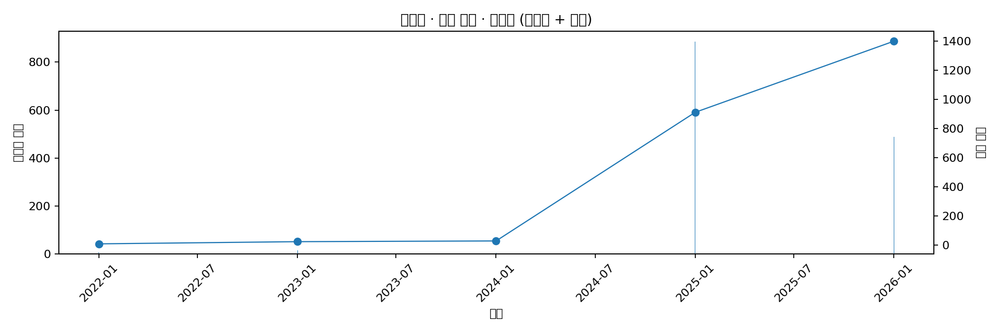

월별 (구간별 + 누적)

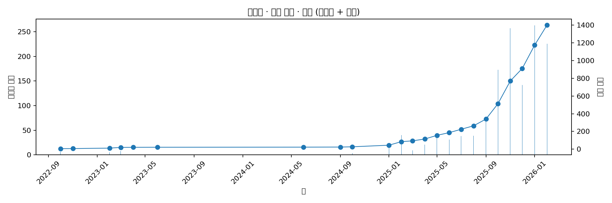

일별 (구간별 + 누적)

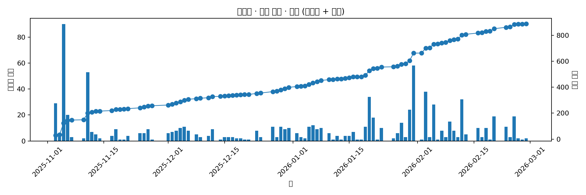

시간별 (구간별 + 누적)

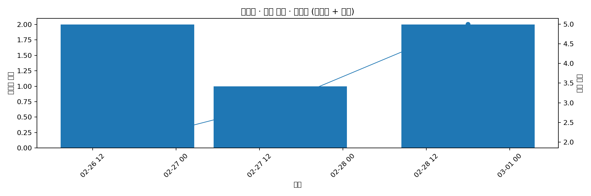

### 수집 시점 기준

- 총 수집 시점 기준 집계 대상 행 수: **1,401**

연도별 (구간별 + 누적)

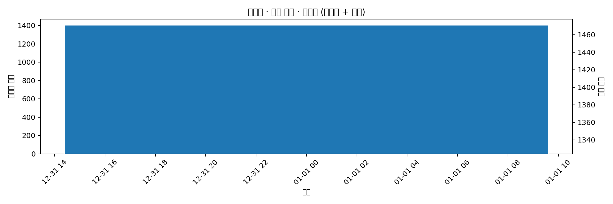

월별 (구간별 + 누적)

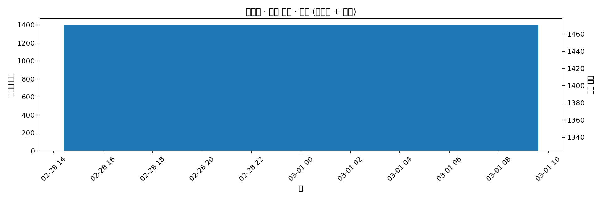

일별 (구간별 + 누적)

시간별 (구간별 + 누적)

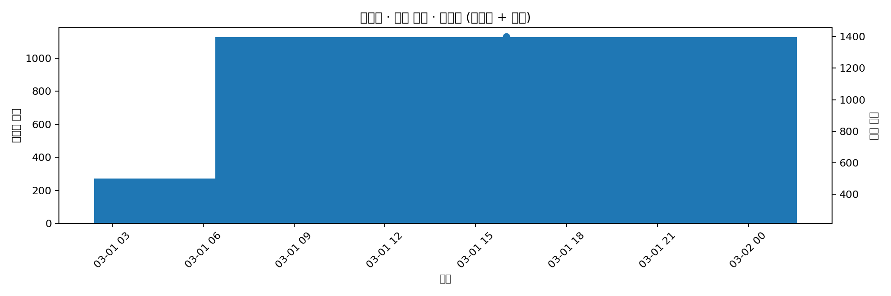

## 이벤트

### 생성 시점 기준

- 총 생성 시점 기준 집계 대상 행 수: **215,991**

연도별 (구간별 + 누적)

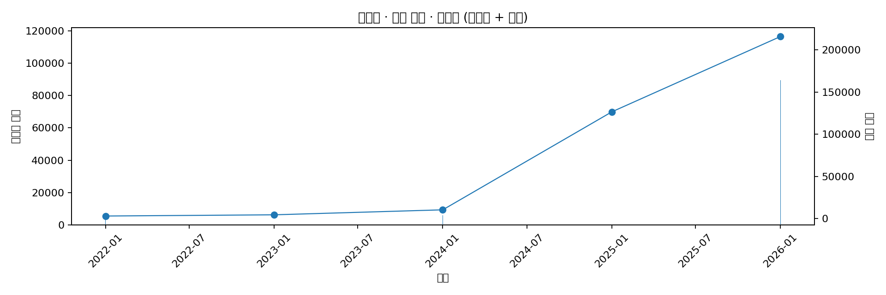

월별 (구간별 + 누적)

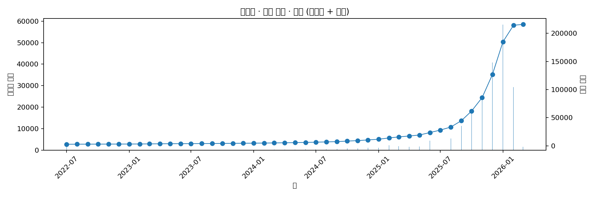

일별 (구간별 + 누적)

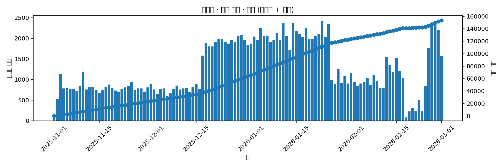

시간별 (구간별 + 누적)

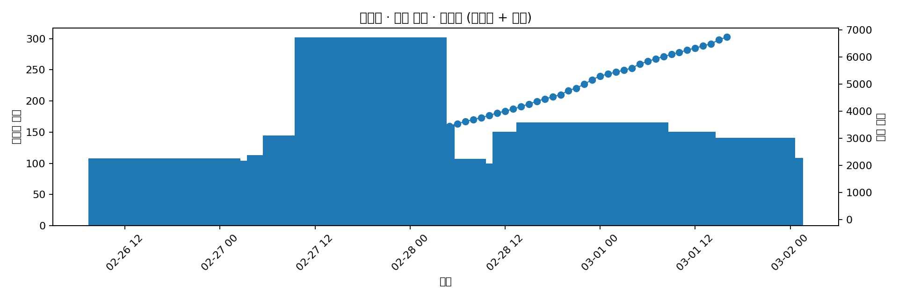

### 수집 시점 기준

- 총 수집 시점 기준 집계 대상 행 수: **215,991**

연도별 (구간별 + 누적)

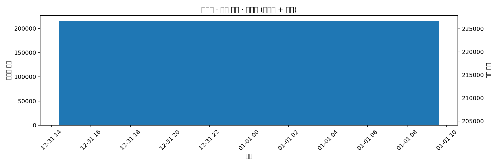

월별 (구간별 + 누적)

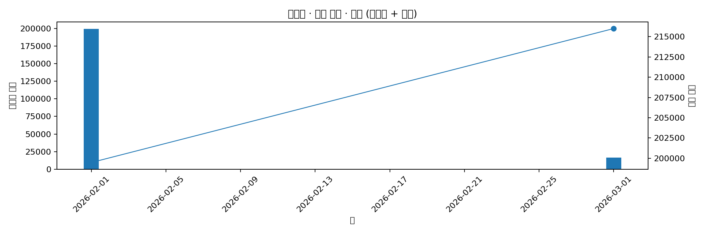

일별 (구간별 + 누적)

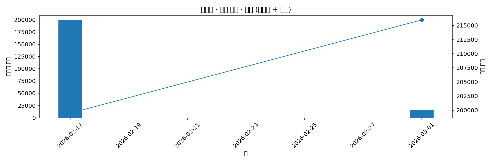

시간별 (구간별 + 누적)

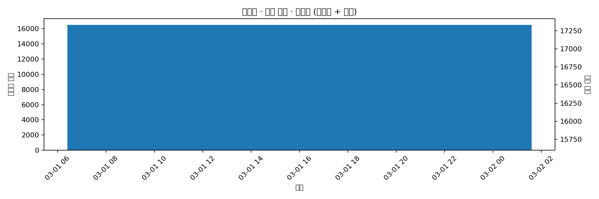

## 마켓

### 생성 시점 기준

- 총 생성 시점 기준 집계 대상 행 수: **575,715**

연도별 (구간별 + 누적)

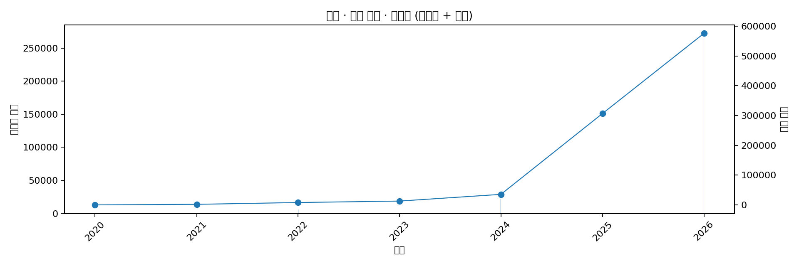

월별 (구간별 + 누적)

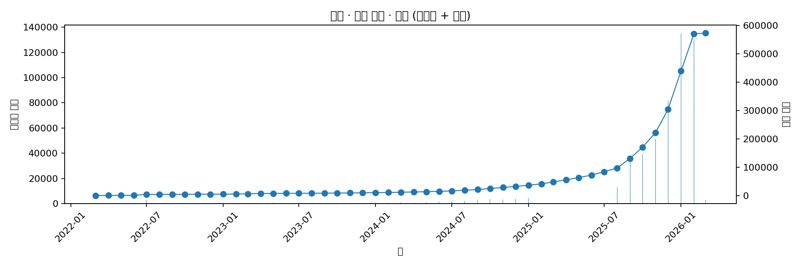

일별 (구간별 + 누적)

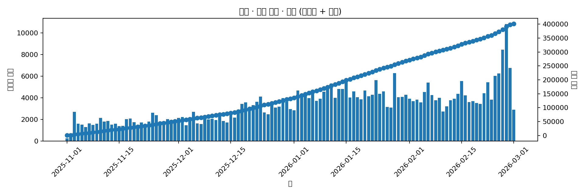

시간별 (구간별 + 누적)

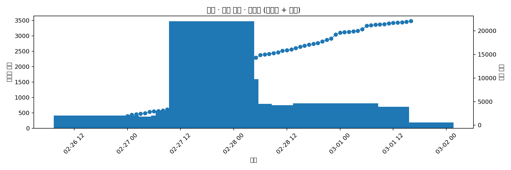

### 수집 시점 기준

- 총 수집 시점 기준 집계 대상 행 수: **575,743**

연도별 (구간별 + 누적)

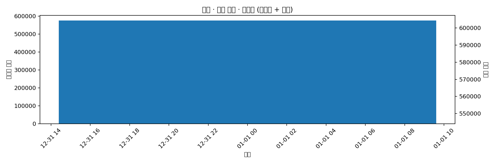

월별 (구간별 + 누적)

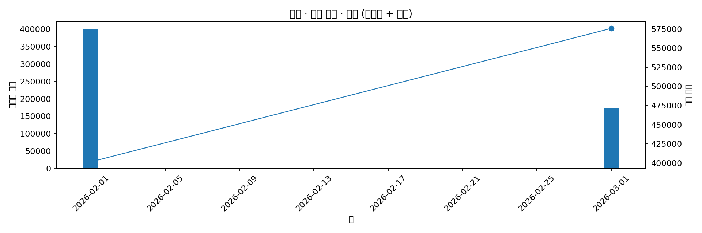

일별 (구간별 + 누적)

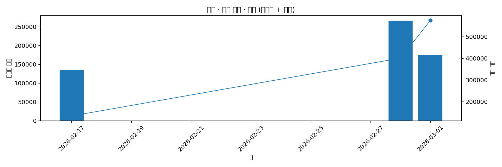

시간별 (구간별 + 누적)

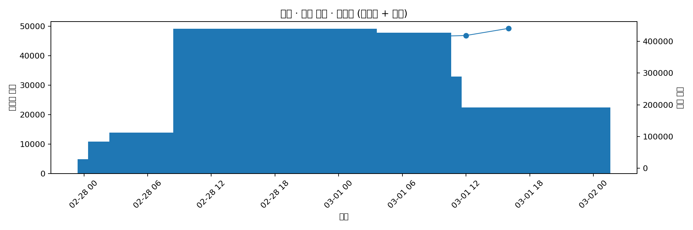

